Crear un superusuario para iniciar sesion en localhost sin docker
python manage.py createsuperuser

# Validaciones

## Cliente
- El nit no puede estar repetido
- EL nit no puede tener una longitud mayor a 9 

## Server
    - Validacion de ip
    - Al crear un servidor no este otro servidor con la misma ip
    - Al actualizar la ip del servidor no este otro server con esa ip

# Service
    - Validacion de porcentaje no puede ser mayor a 100
    - Validacion de capacidad lo maximo que se permite es de 1000 GB
    - Validacion el uso no puede superar la capacidad

## Ejemplos de ip validas

validate_ip_address("10.10.10.10")

validate_ip_address("10.10.10.01")

validate_ip_address("10.10.10.300")

validate_ip_address("10.260.10.300")

validate_ip_address("192.168.1.20")

[output]

IP address 10.10.10.10 is valid. la funcion retorna True

IP address 10.10.10.01 is valid. la funcion retorna True

IP address 10.10.10.300 ,la funcion retorna False

IP address 10.260.10.300 ,la funcion retorna False

IP address 192.168.1.20 is valid. la funcion retorna True 

# Se crea un envio de correo en el caso de que el uso del servicio supere el umbral , para ello seguir las siguientes instrucciones
    - Modificar el archivo .env y crear las variables de correo y contraseña de la siguiente manera
    email=######@####.###
    password=#####

# Eliminar todas las imagenes,volumes

    docker system prune -f
    Eliminar imagenes menor a 48 horas
    docker image prune --all --filter until=48h

    Eliminar todos los volumes
    docker volume rm $(docker volume ls -q)

# Correr contenedores

    - docker-compose build
    - docker-compose up

# Entrar a pgadmin 

   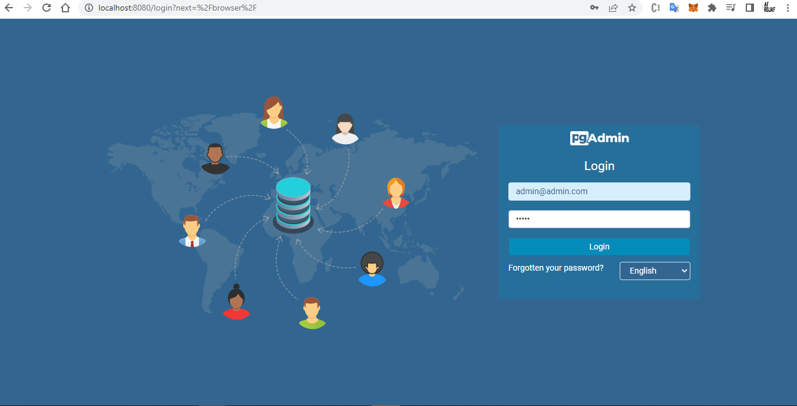
   
   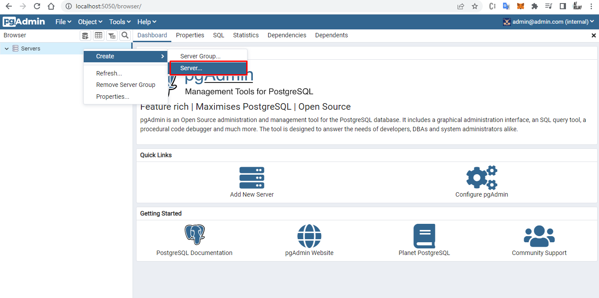

   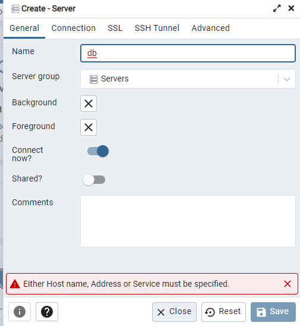

   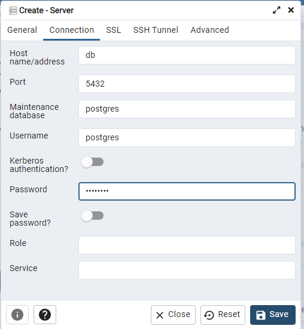

## Diagramas

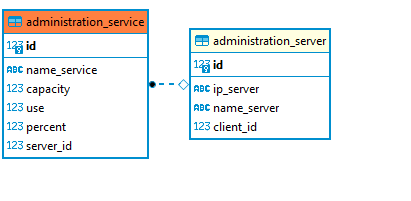

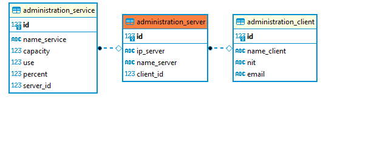

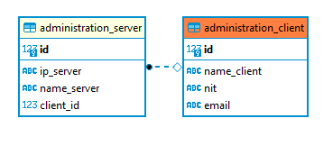

# Ejecutar migraciones en el docker
    docker-compose run app python3 manage.py makemigrations
    docker-compose run app python3 manage.py migrate

# Crear un usuario para poder entrar al login 
    docker-compose run app python3 manage.py createsuperuser

# Ejecutar comando que envia correo a los clientes que tienen servicios que superan el umbral
    docker-compose run app python3 manage.py validate_services

# Interfaces

### Inicial
   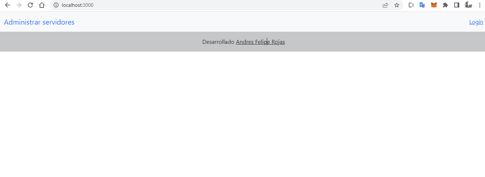

### Login
   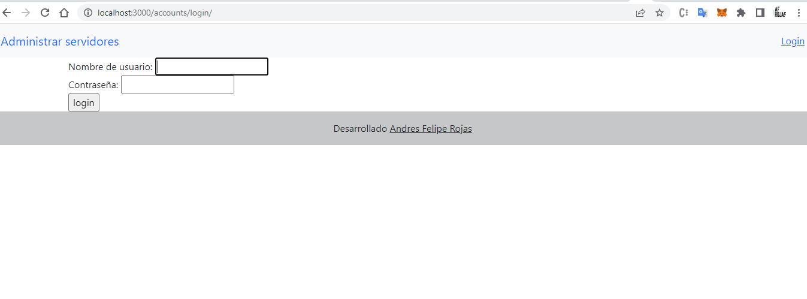

### Logueado 

   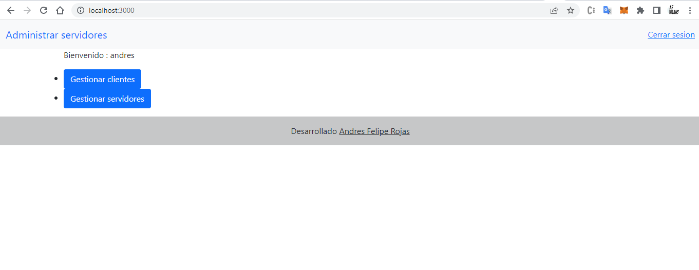

### Interfaz gestionar clientes

   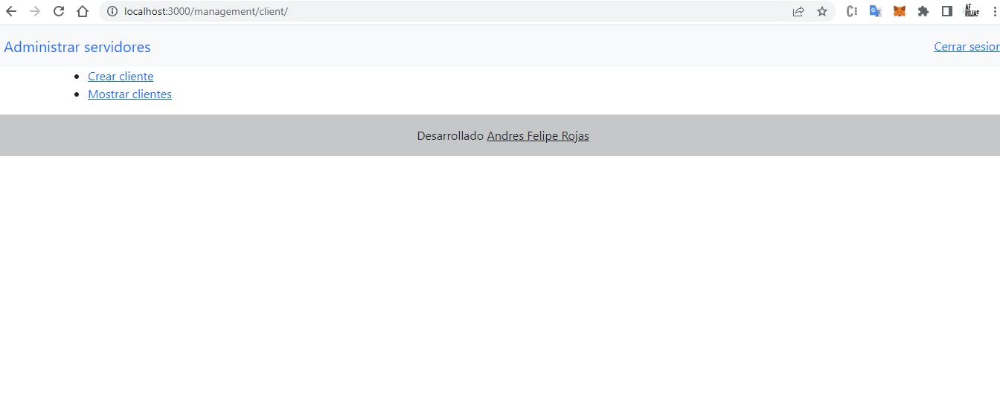

### Interfaz Crear cliente
   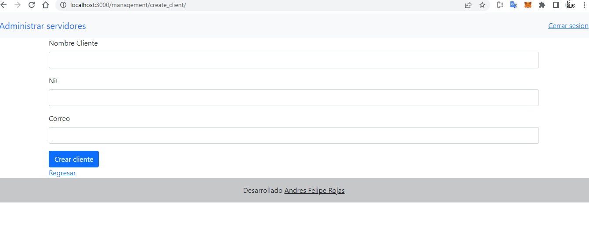

### Interfaz Mostrar clientes

   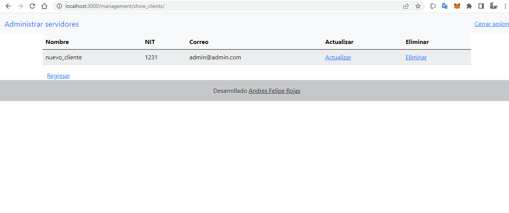

### Interfaz Interfaz gestionar servidores

   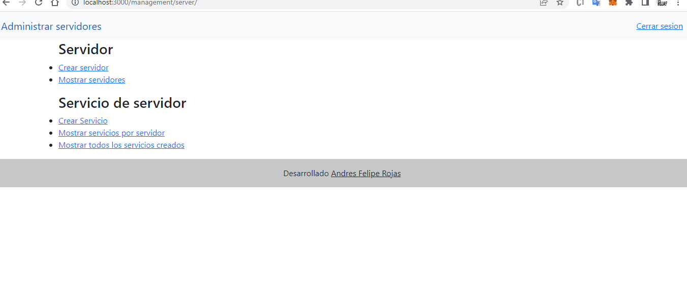
